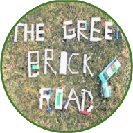

===========================
The Green Brick Road portal
===========================

.. image:: https://img.shields.io/website-up-down-green-red/https/the-green-brick-road.org.svg
   :target: https://the-green-brick-road.org
   :alt: Website

About The Project
=================

This project build, install and publish the portal of The Green Brick Road FLL team on github pages.

.. image:: https://badgen.net/github/checks/the-green-brick-road/portal
   :target: https://github.com/the-green-brick-road/portal/actions/workflows/release.yml
   :alt: Status
.. image:: https://img.shields.io/static/v1?label=license&message=Proprietary&color=informational
   :target: ./LICENSE
   :alt: License
.. image:: https://badgen.net/github/commits/the-green-brick-road/portal/main
   :target: https://github.com/the-green-brick-road/portal
   :alt: Commits
.. image:: https://badgen.net/github/last-commit/the-green-brick-road/portal/main
   :target: https://github.com/the-green-brick-road/portal
   :alt: Last commit

Built With
----------

.. image:: https://img.shields.io/static/v1?label=React&message=18&color=informational
   :target: https://reactjs.org/
   :alt: React
.. image:: https://img.shields.io/static/v1?label=Node.js&message=19.8&color=informational
   :target: https://nodejs.org/en/
   :alt: Node.js
.. image:: https://img.shields.io/static/v1?label=material-ui&message=5.12.2&color=informational
   :target: https://mui.com/material-ui/getting-started/installation
   :alt: Material-UI

Principle
=========

This project builds a react website and publish it on the repository associated github pages.

It's then registered under the domain name the-green-brick-road.com manually

Prerequisites
=============

The development of the website uses the node alpine container. You shall be able to retrieve it from the docker hub using :

.. code:: bash
    docker pull node:alpine-latest

Development
===========

Using the script provided in [scripts/start.sh](scripts/start.sh)

Publication
===========

The target publication is github pages . The CI/CD pipeline is designed to automatically publish the portal onto the github pages once all the mandatory checks have passed

Testing
=======

.. image:: https://codecov.io/gh/the-green-brick-road/portal/branch/main/graph/badge.svg?token=MCRQQ7PXI2
   :target: https://codecov.io/gh/the-green-brick-road/portal
   :alt: codecov

Security
========

The build pipelines applies SAST and third party vulnerabilities analysis

The develop branch website is regularly checked for vulnerabilities using zaproxy as DAST.

Issues
======

.. image:: https://img.shields.io/github/issues/the-green-brick-road/portal.svg
   :target: https://github.com/the-green-brick-road/portal/issues
   :alt: Open issues
.. image:: https://img.shields.io/github/issues-closed/the-green-brick-road/portal.svg
   :target: https://github.com/the-green-brick-road/portal/issues
   :alt: Closed issues

Roadmap
=======

Contributing
============

.. image:: https://contrib.rocks/image?repo=the-green-brick-road/portal
   :alt: GitHub Contributors Image

This website is dedicated to the-green-brick-road First Lego League Team communication.

License
=======

This code is under the-green-brick-road copyright.

Contact
=======

The Green Brick Road team - green.brick.road.first@gmail.com

Acknowledgments
===============

This application was built using :

.. image:: https://img.shields.io/static/v1?label=react-create-app&message=latest&color=informational
   :target: https://github.com/facebook/create-react-app
   :alt: create-react-app
.. image:: https://img.shields.io/static/v1?label=react-most-wanted&message=latest&color=informational
   :target: https://github.com/TarikHuber/react-most-wanted/
   :alt: react-most-wanted